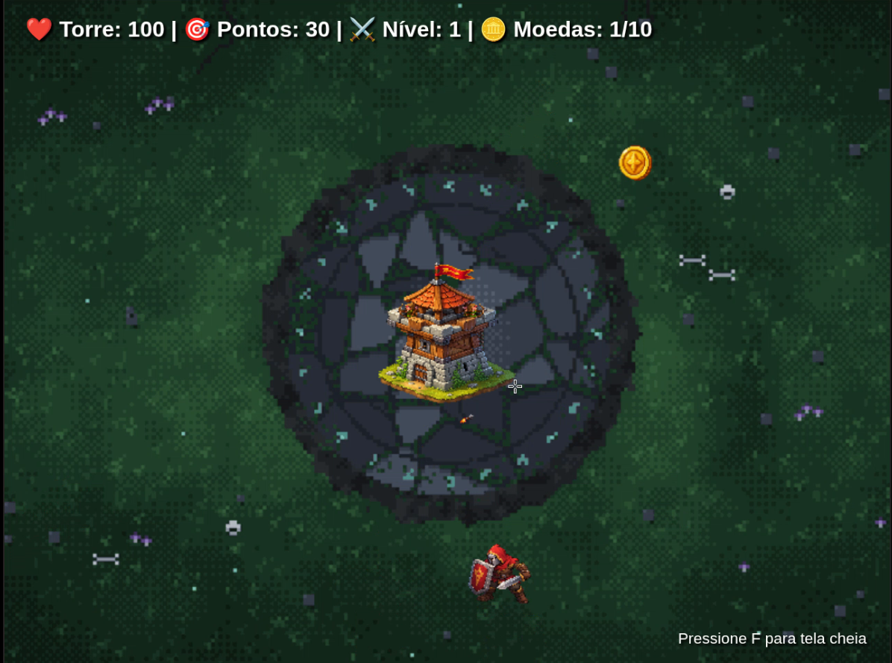
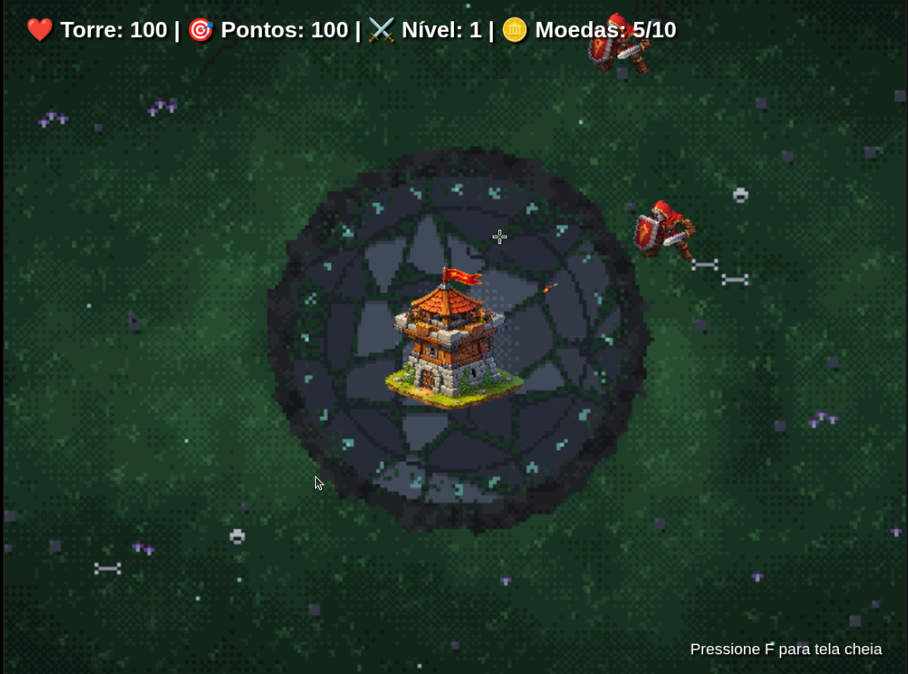
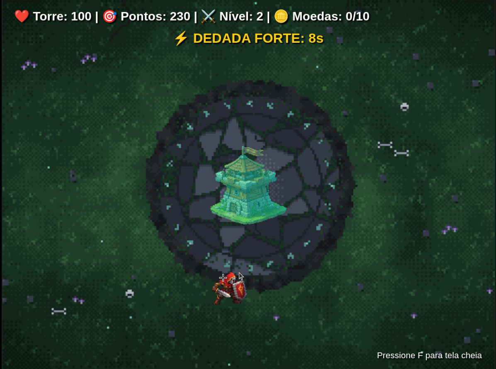

# Tower Defense - WebGL

## (a) O Jogo
Jogo de defesa de torre feito em WebGL 2. A torre fica no centro do mapa e atira sozinha nos inimigos que chegam pelos 4 lados da tela. O jogador ajuda dando "dedadas" nos inimigos com o mouse e coletando moedas, que liberam a Dedada Forte. A cada 30 segundos o nível sobe e os inimigos ficam mais rápidos. O jogo acaba quando a vida da torre chega a zero.

**Jogar:** https://braia156.github.io/tower-defense-cg/

**Controles:**
* Mouse: dedada nos inimigos e coleta de moedas
* F: entrar/sair da tela cheia
* P ou Esc: pausar

## (b) Criadores
* Bryan Felipe - GitHub: [bryanalves04](https://github.com/bryanalves04)
* Pedro Soares - GitHub: [pedrohmsoares](https://github.com/pedrohmsoares)

## (c) Media kit

## (d) Opcionais
1. **Tela cheia**: faça com que seja possível colocar em tela cheia e que a razão de aspecto do jogo seja sempre mantida, independente das dimensões da janela (_windowed_ ou _full screen_), mas que o jogo ocupe a maior área possível da janela e ficando centralizado
   * No jogo: a tecla F liga/desliga a tela cheia e o jogo é escalado mantendo a proporção 4:3, centralizado na janela.
2. 🌟 **Sons**: Colocar efeitos sonoros e música de fundo no seu jogo
   * No jogo: trilha sonora em loop e sons de tiro, dedada, dano na torre, morte de inimigo, subida de nível, moedas e game over.
3. **Colisão entre inimigos**: tome o cuidado para evitar que "um inimigo entre no outro", verificando se estão colidindo ao atualizar suas posições
   * No jogo: a cada quadro os inimigos que ficam perto demais são empurrados para longe um do outro.
4. **Moedas**: crie uma moeda que o jogador adquire, de alguma forma, e que pode ser usada para: (a) melhorias na(s) torre(s), ou (b) criar novas torres, ou (c) para melhorias do herói, ou para outro motivo interessante
   * No jogo: uma moeda aparece no mapa a cada 4 segundos e some depois de 5. Ao juntar 10 moedas o jogador ganha a Dedada Forte por 8 segundos, em que uma dedada derrota o inimigo na hora.
5. **Implementação criativa**: qualquer implementação que não fuja muito do pedido, mas que traga elementos novos e interessantes para o seu jogo é bem-vinda!
   * No jogo: enquanto a Dedada Forte está ativa, a torre fica trocando de cor (efeito arco-íris feito no fragment shader).

## (e) Créditos
**Imagens**
* Cenário (`cenario_dark_fantasy.png`): gerado com IA (Claude, da Anthropic)
* Torre, inimigo, projétil e moeda (`torre.png`, `inimigo.png`, `projetil.png`, `moeda.png`): gerados com ferramentas de IA

**Sons**
* Tiro (`somTiro.wav`): [SFX Engine](https://sounds.sfxengine.com/sound-effects/se_fhiomdvfemgvle77.wav)
* Dano na torre (`somDanoTorre.wav`): feito por nós no [sfxr](https://sfxr.me/)
* Dedada (`somDedada.wav`): feito por nós no [sfxr](https://sfxr.me/)
* Morte do inimigo (`inimigo_morte_explosao_grave.wav`): gerado com ferramenta de IA
* Game over (`somGameOver.mp3`): lumora_studios, no [Pixabay](https://cdn.pixabay.com/download/audio/2025/03/26/audio_68e17ac523.mp3?filename=lumora_studios-pixel-game-over-319170.mp3)
* Subida de nível (`somLevelUp.wav`): [SFX Engine](https://sounds.sfxengine.com/level-up-fantasy-game-ib2i2pxs.wav)
* Moeda surgindo (`moeda_surgindo.wav`): gerado com ferramenta de IA
* Moeda coletada (`moeda_pega.wav`): gerado com ferramenta de IA
* Trilha sonora (`trilhaSonora.mp3`): deuslower, no [Pixabay](https://cdn.pixabay.com/download/audio/2024/10/07/audio_abe8aee6e9.mp3?filename=deuslower-atmosphere-dark-fantasy-dungeon-synth-248210.mp3)
